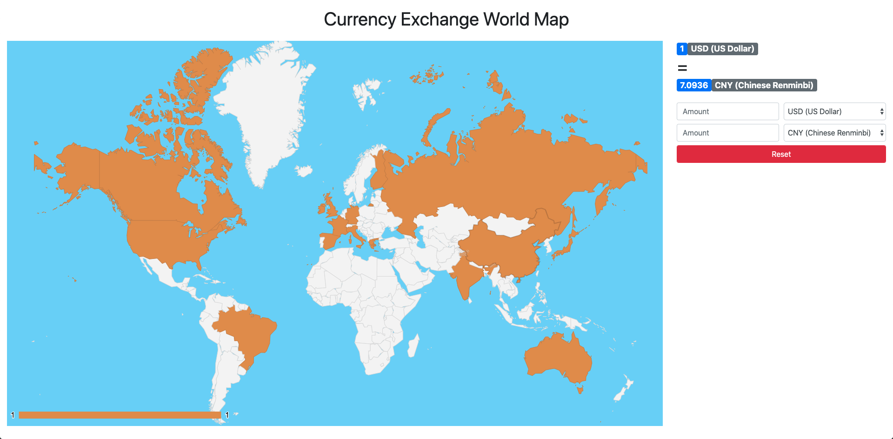

# Currency Exchange World Map
A web application that utilizes a public currency converter API to display and calculate currency exchange rates between any 2 user-selected countries on an interactive world map.

## Live Demo
Coming soon!

## Technologies Used
- JavaScript
- jQuery
- Bootstrap 4
- HTML5
- CSS3
- Google GeoChart - https://developers.google.com/chart/interactive/docs/gallery/geochart
- Currency Converter API - https://www.currencyconverterapi.com/

## Features
- User can view world map
- User can view currency converter form
- User can select countries on world map
- User can view different currency exchange rates of countries selected
- User can input an amount for one currency and see the equivalent amount of the comparison currency

## Preview

## Development
