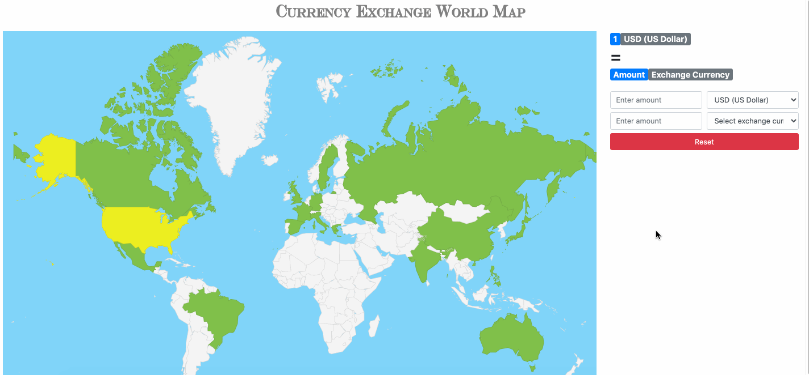

# Currency Exchange World Map
A web application that utilizes Google GeoCharts and a public currency exchange rate API to display and calculate currency exchange rates between the US and a user-selected country on an interactive world map.

## Live Demo
Try the application live at http://currency-exchange-world-map.themichaelzhu.com/

## Technologies Used
- JavaScript
- jQuery
- Bootstrap 4
- HTML5
- CSS3
- Google GeoChart - https://developers.google.com/chart/interactive/docs/gallery/geochart
- Currency Exchange Rate API - https://openexchangerates.org/

## Features
- User can view world map
- User can view currency conversion form
- User can select countries on world map
- User can view different currency exchange rates of selected country compared to the US Dollar
- User can input an amount for one currency and see the equivalent amount of the comparison currency

## Preview


## Development
### Getting Started
1. Clone the repository.
    ```shell
    git clone https://github.com/michaelzhu23/currency-exchange-world-map.git
    cd currency-exchange-world-map
    ```
2. Open directory with a code editor and open default browser from index.html file.
